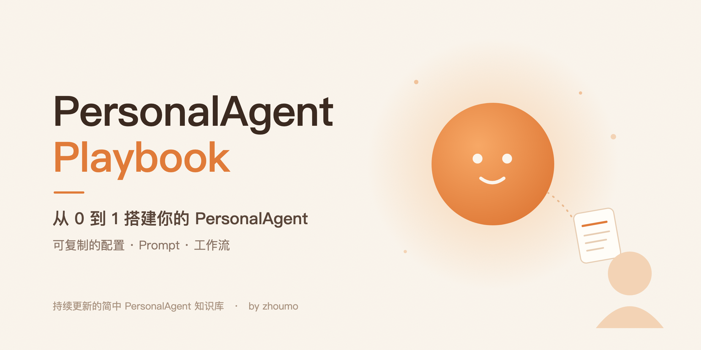

  <b>从 0 到 1 搭建你的 PersonalAgent</b> 
  可复制的配置、Prompt 和工作流 · 持续更新的简中知识库

---

## 为什么是 PersonalAgent

2026 年秋天，Grok Bot、Muse、Cue、Dots 在一个多月里相继上线。AI 第一次不只是回答问题，而是有了自己的电脑，能替你收邮件、排日程、打电话，甚至花钱。

PersonalAgent 正在成为新的风口，也会慢慢走进工作和生活的方方面面。

对普通人来说，它也是**学会和 AI 协作最小、最轻的入口**：不用写代码，不用搭系统，从交给它一件小事开始。

## 这份手册帮你做三件事

- **看懂**：用 7 个问题，看懂任何一款 Agent
- **选对**：四款产品逐项对比，按你要做的事挑一款
- **用起来**：一手案例和可复制的模板，从一件小事开始放权

每个判断都附原始出处；主推的产品，缺点也照写。

## 从哪里开始

- 第一次了解 → [01 · 什么是 PersonalAgent](01-概念/README.md)
- 正在挑产品 → [02 · 7 个维度看懂四款产品](02-7个维度看懂四款产品/README.md)
- CEO、创始人 → 03 · CEO 上手指南（即将上线）

## 目录

| | 章节 | 内容 |
|:---:|---|---|
| 01 | [什么是 PersonalAgent](01-概念/README.md) | 它和聊天机器人有什么不同 |
| 02 | [7 个维度看懂四款产品](02-7个维度看懂四款产品/README.md) | 逐项对比、按场景选型、国内能用吗 |
| 03 | CEO 场景手册 | *即将上线* |
| 04 | 模板库 | *即将上线* |
| 05 | 进阶：自己搭一个 PersonalAgent | *即将上线* |
| 06 | 安全与避坑 | *即将上线* |
| 07 | 读者案例 | *即将上线* |

## 关于作者

**zhoumo** · Agent Player

前数字游民，文科生，正在靠 AI 赚钱。这份手册里的方法，作者自己每天都在研究和使用。

[X @thiszhoumo](https://x.com/thiszhoumo) · [thisweekend.site](https://thisweekend.site)

---

  
    ⭐ Star 关注更新 · 有错误或想分享用法，欢迎 <a href="../../issues">提 Issue</a> 
    文章 <a href="https://creativecommons.org/licenses/by-nc-sa/4.0/deed.zh-hans">CC BY-NC-SA 4.0</a> · 模板 <a href="https://creativecommons.org/publicdomain/zero/1.0/deed.zh-hans">CC0</a> · <a href="SOURCES.md">出处总表</a> · <a href="LICENSE">LICENSE</a>
  

